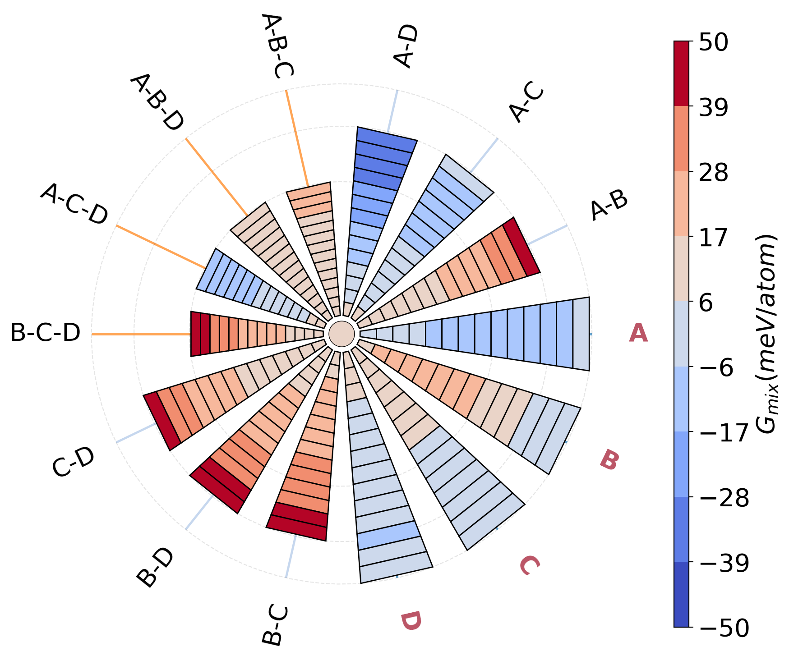

## Symplex Plots

Method to decompose high dimensional simplices into high symmetry paths for visualizing Multi Principal Element Alloys (MPEAs).



To use the code:

```python
git 
```

Install the requirements in a virtualenv:
```python
cd Symplex-main
pip install -r requirements.txt
```
An example notebook, example.ipynb has been provided with detailed instructions on how to plot pre-loaded properties and custom user data.


